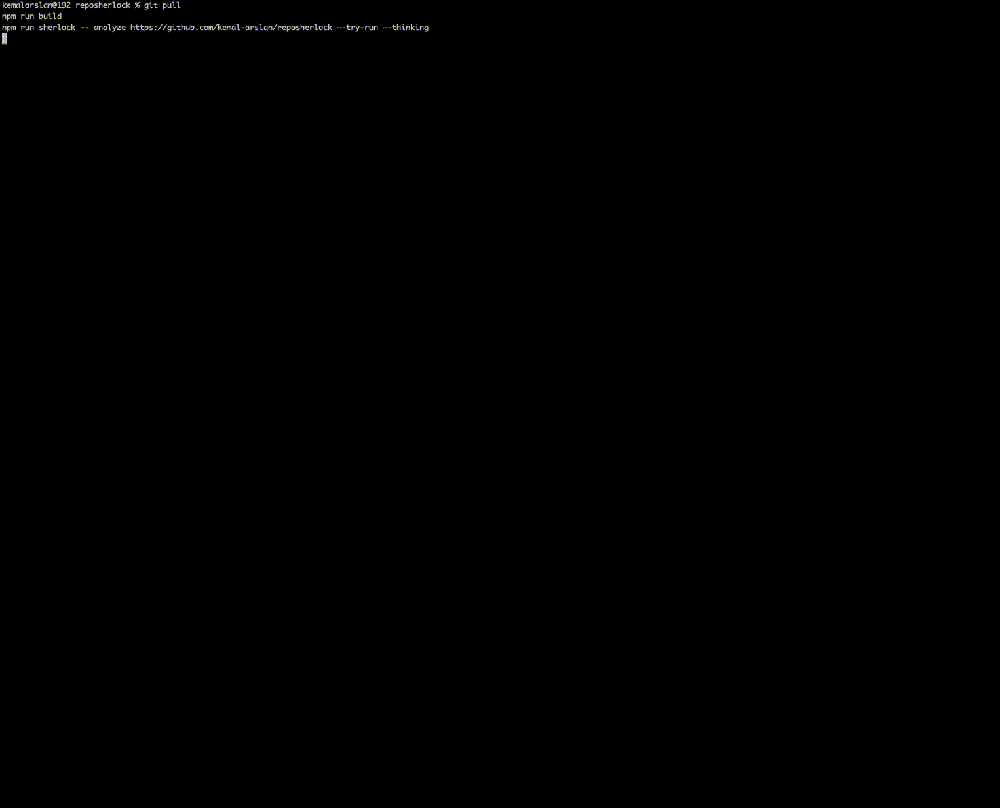

# RepoSherlock

English | [Türkçe](README.tr.md)

Drop a GitHub repo URL or local path and get architecture, run guidance, risks, and actionable issues.

## Live CLI Preview



## Why RepoSherlock

- Before you run: understand architecture.
- Before you trust: see security and license risks.
- Before you waste time: start with verified commands.

## What makes it different?

RepoSherlock does not only guess commands. With `--try-run`, it attempts install/test/build/start steps in a sandbox and records evidence (signals, timeouts, and notes) in the run report.

## What it does

RepoSherlock analyzes a public GitHub repository or local project path and writes a report bundle under:

- `.reposherlock/output/<run-dir>/`

Default run directory is timestamp-based (for example: `20260208-103104`).

Artifacts include:
- `report.md` / `report.json`
- `architecture.mmd` / `architecture.json`
- `risks.md` / `risks.json`
- `issues.json`
- `issues.good-first.md` / `issues.good-first.json`
- `README_2.0.md`
- `run_attempt.md` / `run_attempt.json` (only with `--try-run`)
- `pr_draft.md` (only with `--pr-draft` or wizard Full Sherlock profile)

When LLM polish is enabled, additional variants are emitted:
- `README_2.0.deterministic.md` / `README_2.0.llm.md`
- `issues.deterministic.json` / `issues.llm.json`
- `report.deterministic.md` / `report.llm.md`

## Sample output (short)

```text
Run Plan
Target: https://github.com/octocat/Hello-World
Try-Run: enabled

Sherlock Thinking
✓ Validating repository target and runtime profile
✓ Planning scan strategy and safe execution path
✓ Preparing architecture, risk, and issue synthesis

Summary
Repo type: web
Risks: high=0, med=1, low=0
Output: .reposherlock/output/20260208-103104
```

## Install

Bun (recommended):

```bash
bun install
bun run build
```

Node fallback:

```bash
npm install
npm run build
```

## Quick start

Minimum typing (interactive wizard):

```bash
bun run sherlock
```

Analyze a repo:

```bash
bun run sherlock -- analyze https://github.com/octocat/Hello-World --try-run
```

Analyze a local path:

```bash
bun run sherlock -- analyze . --no-network --try-run
```

Open summary for an existing run:

```bash
bun run sherlock -- report .reposherlock/output/<run-dir>
```

Check local toolchain:

```bash
bun run sherlock -- doctor
```

UI demo mode:

```bash
bun run sherlock -- ui-demo
```

Node fallback (if you do not use Bun):

```bash
npm run sherlock
```

## Common use cases

- Joining a new codebase: get runnable quickstart and architecture hotspots fast.
- Quick audit: review license, CI, secret patterns, and dependency risks in one pass.
- Maintainer triage: generate actionable issues and good-first issue candidates.
- Dependency evaluation: inspect a public repository before adopting it.

## Configuration

RepoSherlock CLI workflow runs with LLM polish enabled in current release.
Deterministic analysis is still produced and saved alongside LLM-polished outputs.

For providers that require credentials (OpenAI, Gemini, Anthropic, Grok, OpenAI-compatible), set:

```bash
export LLM_API_KEY="..."
```

Optional:
- `LLM_MODEL`
- `LLM_BASE_URL`

You can also set provider/model/key in the interactive wizard and store the key in:
- `~/.reposherlock/credentials.json` (chmod 600)

## How it works (high level)

RepoSherlock scans repository structure and key files, builds a local module graph, extracts runtime/env/risk signals, optionally executes a sandbox try-run, then writes a report bundle. When LLM polish is enabled, it rewrites deterministic outputs for clarity without changing discovered commands and facts.

## Notes

- CLI examples use one command name consistently: `sherlock`.
- Input can be a GitHub repository URL or an existing local directory path.
- Reports are heuristic; verify before production use.
- Secrets are redacted in human outputs.
- Try-run is opt-in (`--try-run`) and executed with timeouts/output caps.

## Development

```bash
bun test
# or
npm test
```

## License

MIT
